# Replication的結果

* IRF, Bootstrap C.I., Variance Decomposition, Historical Decomposition皆相同

* 上述結果結果依據程式來源分別命名後放在`comparison.zip`內
  
## Raw Data

### 原始資料

* 隔夜拆款利率(%)
* Sentiment
* 臺閩地區核發建築物建造執照數(件)
* 消費者貸款-購置住宅貸款、房屋修繕貸款、建築貸款(新台幣百萬元)
* 信義房價指數(台灣)

```{r figure1-1, echo=FALSE, fig.cap="Raw Data: R, Sent, Permit, Loan, HP", out.width = '50%', fig.align="center"}
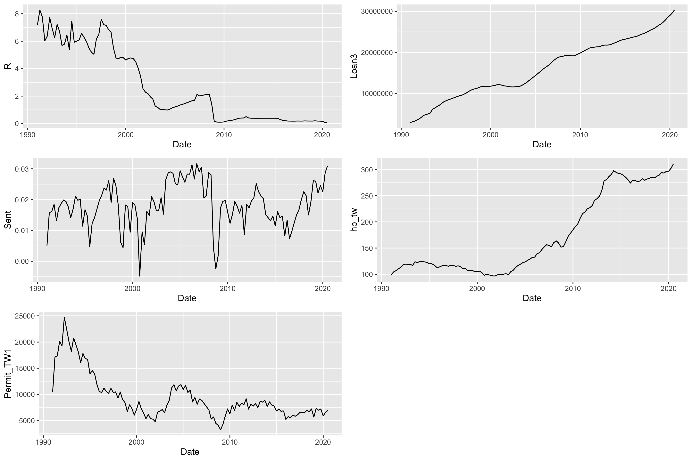
```

### 經轉換過後的原始資料

* 隔夜拆款利率(%)
* Sentiment
* 對數臺閩地區核發建築物建造執照數(件)
* 消費者貸款-購置住宅貸款、房屋修繕貸款、建築貸款(新台幣百萬元)-年增率
* 信義房價指數(台灣)-年增率

```{r figure1-2, echo=FALSE, fig.cap="Transformed Raw Data: R, Sent, LPermit, dLloan, dLHP", out.width = '50%', fig.align="center"}
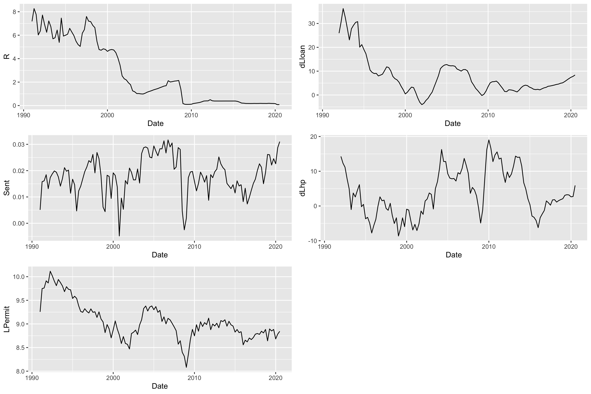
```

## Model Results

### 認定條件
$$
\left[
\begin{array}{c}
	\varepsilon_t^R\\
	\varepsilon_t^{Sent}\\
	\varepsilon_t^{LPermit}\\
    \varepsilon_t^{dLloan}\\
	\varepsilon_t^{dLhp}
\end{array}
\right]
=
\left[
\begin{array}{ccccc}
a_{11} &0 &0 &0 &0\\
a_{21} &a_{22} &0 &0 &0\\
a_{31} &a_{32} &a_{33} &0 &0\\
a_{41} &a_{42} &a_{43} &a_{44} &0\\
a_{51} &a_{52} &a_{53} &a_{54} &a_{55}
\end{array}
\right]
\left[
\begin{array}{c}
	e_t^{mp}\\
	e_t^{exp}\\
	e_t^{hs}\\
  e_t^{hd}\\
	e_t^{sp}
\end{array}
\right]
$$

### IRF

```{r figure1, echo=FALSE, fig.cap="Monetary Policy Shock", out.width = '90%', fig.align="center"}
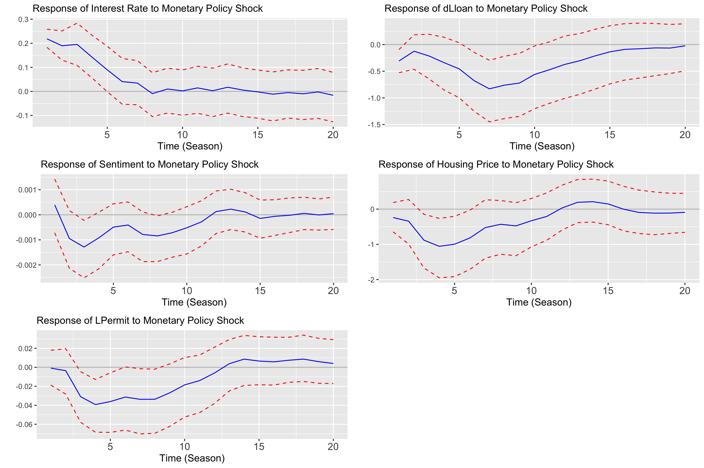
```

```{r figure2, echo=FALSE, fig.cap="Housing Expectation Shock", out.width = '90%', fig.align="center"}
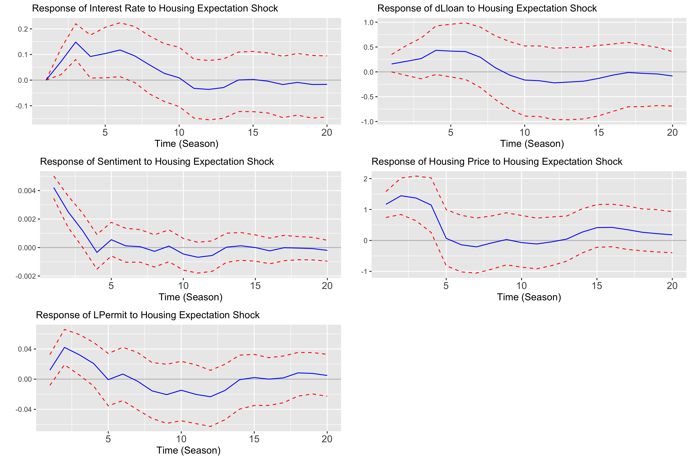
```

```{r figure3, echo=FALSE, fig.cap="Housing Supply Shock", out.width = '90%', fig.align="center"}
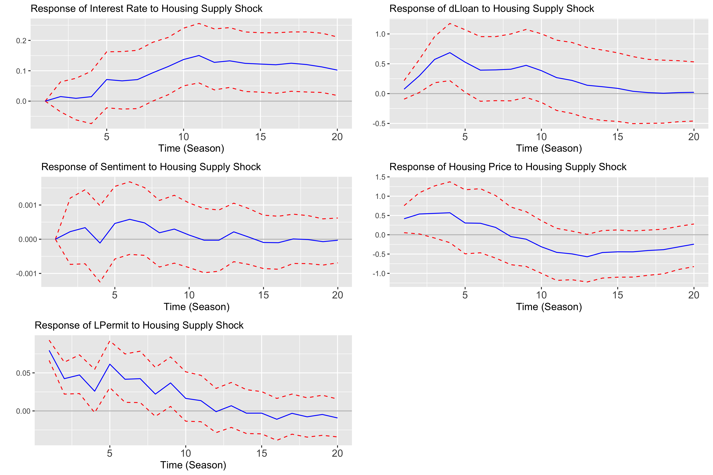
```


```{r figure4, echo=FALSE, fig.cap="Housing Demand Shock", out.width = '90%', fig.align="center"}
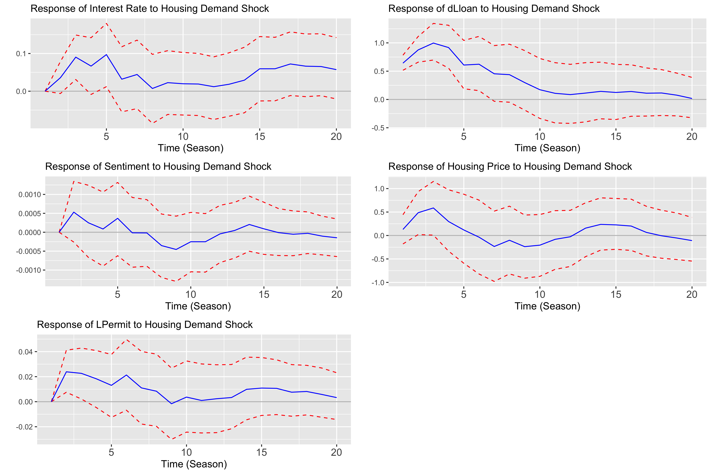
```

```{r figure5, echo=FALSE, fig.cap="Housing Speculation Shock", out.width = '90%', fig.align="center"}
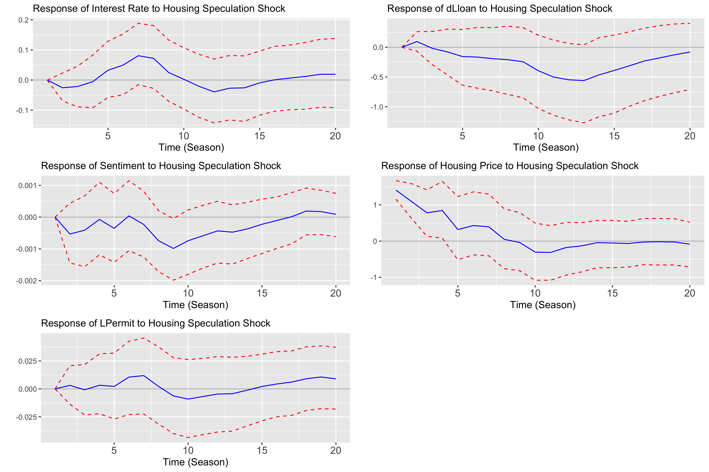
```

### 考量寬鬆貨幣政策IRF

* 在negative shock下看IRF

```{r figure1-negative, echo=FALSE, fig.cap="Negative Monetary Policy Shock", out.width = '90%', fig.align="center"}
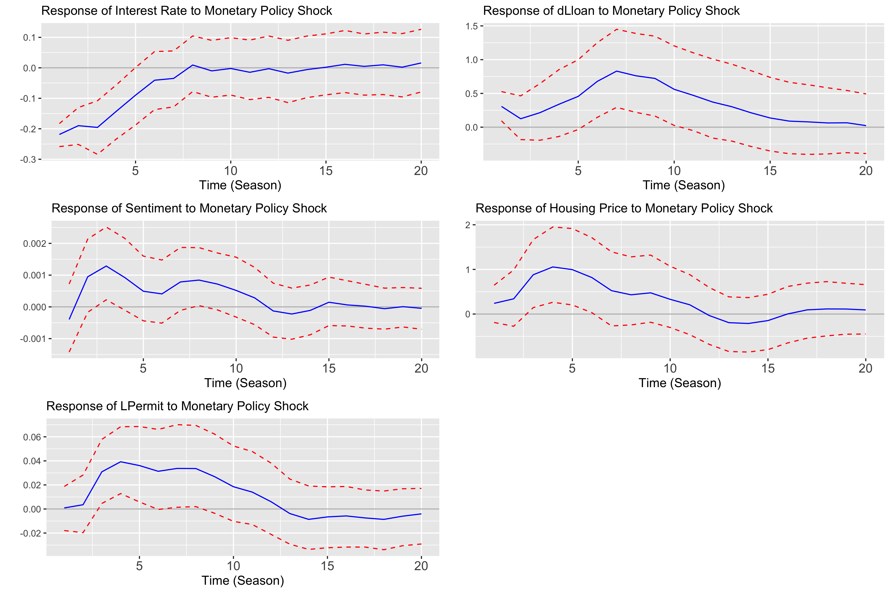
```


### Variance Decomposition

$$
\centering
\begin{tabular}{cccccc}
  \hline
period & mp & exp & hd & hs & sp \\ 
  \hline
1 & 1.60 & 37.19 & 4.39 & 0.43 & 56.39 \\ 
   \hline
2 & 2.32 & 45.68 & 5.63 & 3.03 & 43.34 \\ 
   \hline
4 & 13.30 & 45.03 & 6.77 & 4.15 & 30.74 \\ 
   \hline
8 & 24.94 & 35.61 & 6.96 & 3.78 & 28.71 \\ 
   \hline
12 & 27.28 & 33.91 & 7.03 & 4.72 & 27.07 \\ 
   \hline
16 & 26.30 & 33.48 & 9.42 & 4.73 & 26.08 \\ 
   \hline
20 & 23.92 & 34.77 & 13.25 & 4.61 & 23.45 \\ 
   \hline
\end{tabular}
$$

### Historical Decomposition

將歷史分解的中位數標示於下表。而從房價指標的走勢，將樣本期間分為：房價指數持平期（1991Q1-2002Q4）及房價指數上升期（2003Q1-2020Q3）。

$$
\centering
\small
\centering
\begin{tabular}{cccccc}
  \hline
樣本期間 & Montary Policy Shock & Expectation Shock & Demand Shock & Supply Shock & Speculation Shock \\ 
  \hline
全樣本(1992Q1-2020Q3) & 16.61 & 31.88 & 14.60 & 6.64 & 19.29 \\ 
   \hline
房價持平期(1992Q1-2002Q4) & 28.29 & 32.13 & 6.85 & 44.05 & -4.68 \\ 
   \hline
房價上升期(2003Q1-2020Q3) & 14.14 & 31.64 & 19.79 & 2.08 & 29.61 \\ 
   \hline
\end{tabular}
$$

```{r figure6, echo=FALSE, fig.cap="Historical Decomposition of hp: monetary policy shock", out.width = '60%', fig.align="center"}
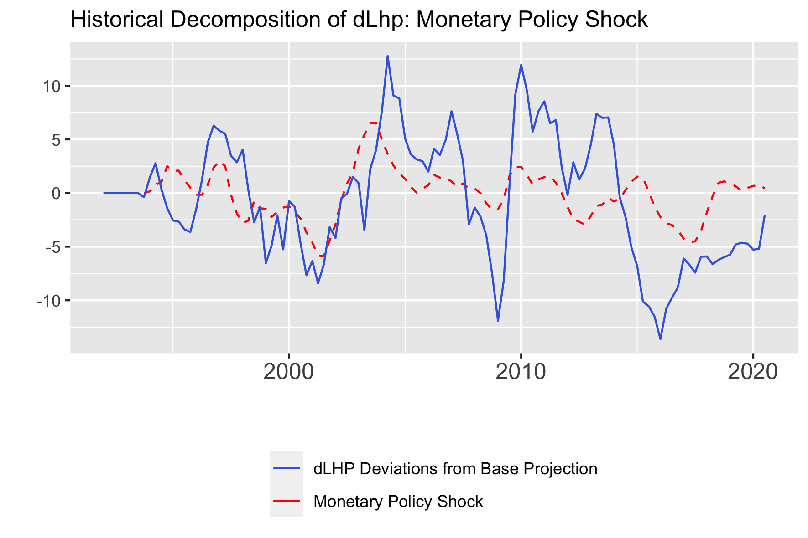
```

```{r figure7, echo=FALSE, fig.cap="Historical Decomposition of hp: expectation shock", out.width = '60%', fig.align="center"}
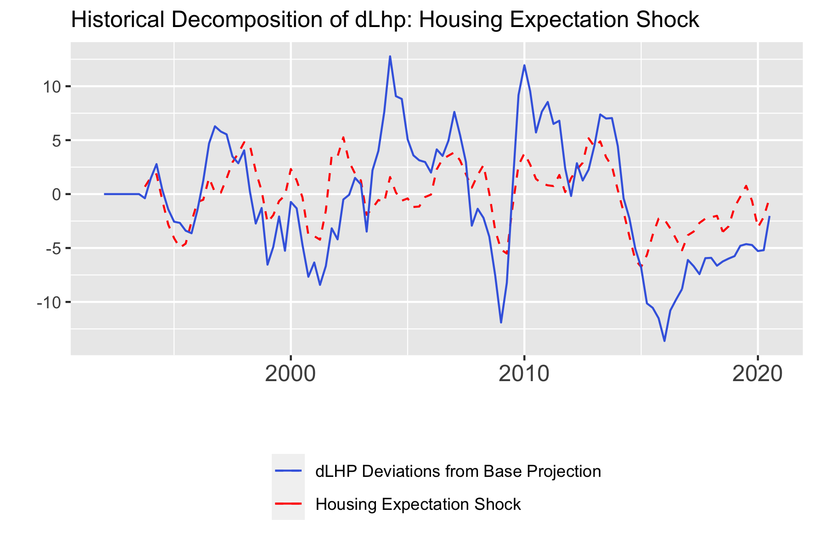
```

```{r figure8, echo=FALSE, fig.cap="Historical Decomposition of hp: supply shock", out.width = '60%', fig.align="center"}
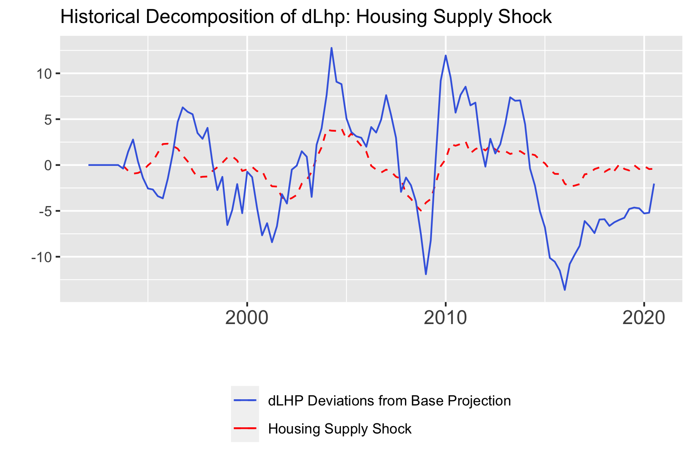
```

```{r figure9, echo=FALSE, fig.cap="Historical Decomposition of hp: demand shock", out.width = '60%', fig.align="center"}
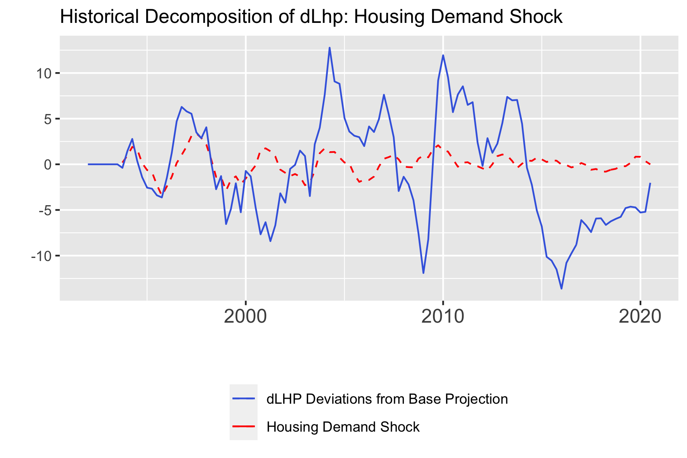
```

```{r figure10, echo=FALSE, fig.cap="Historical Decomposition of hp: speculation shock", out.width = '60%', fig.align="center"}
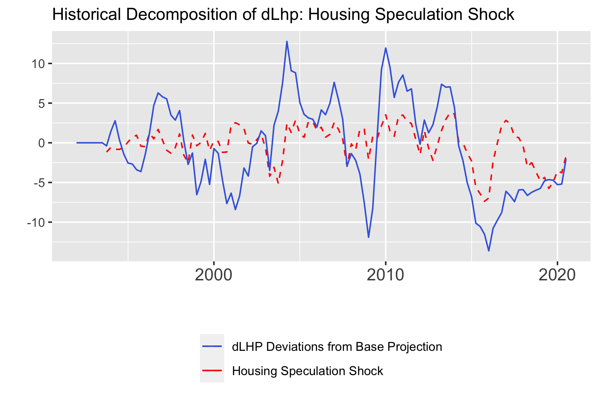
```


\pagebreak